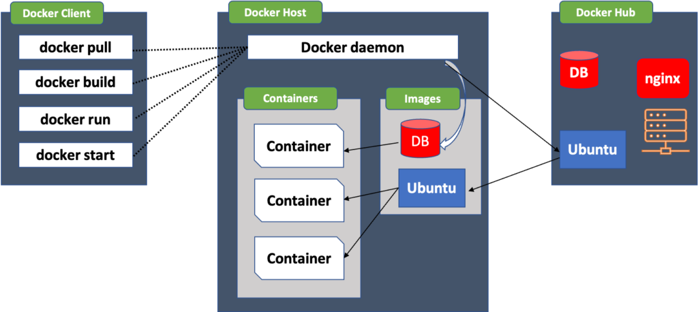
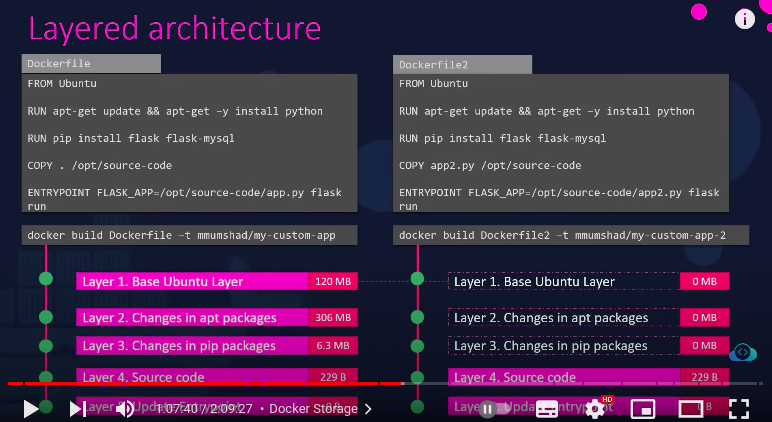

# Docker

Docker is opensource centralize platform design to Create, Deploy and run application.

Docker is OS level Virtualization technique, That can help us create Containers on the OS, 
Container uses the base host image as the OS image of itself. & resources it get as per requirement from H/W. it is very lieghtweight. 

# Docker Architecht :- 



## Advantages of Docker :- 

1. Lightweight 
2. No pre-allocation of RAM 
3. CI -effeciency 
4. less Cost
5. it can run on physical H/W, Hypervisor, Cloud
6. you can reuse the Image.
7. It takes very less time to create Container

## Disadvantes of Docker - 

1. It doesn't support cross platform
2. Difficult to manage the large amount of container
3. it is not good for GUI based application
4. No solution for Data recovery & Backup.
5. Docker is suitable for only if Developement Operation system and Testing OS is same.


### Docker Basic Commands - 

To check the Images on the Host
``` 
docker images
```
to search for the jenkins image    

``` 
docker search jenkins
``` 

to pull the jenkins image from the dockerhub to your Host 
``` 
docker pull jenkins
``` 
to run the container & give it name 

``` 
docker run -it --name <container name> <image name> /bin/bash
``` 

to check the service is start or not 
``` 
service docker status
``` 

to start the stopped container 
``` 
docker start <container name>
``` 

to go inside the container

``` 
docker attach  <container name>
``` 

to check status of all the container running or stopped
```
docker ps -a
``` 

to check the status of running container

```
docker ps
``` 

to stop the running container 
``` 
docker stop <containername>
``` 

to delete the container 
``` 
docker rm <container name>
```  

************************************************************************


TO DELETE THE DOCKER IMAGES. 

```
docker rmi <image name>
```

➡️ # Port Mapping :- 

```
docker run -p hostport:conatinerport <Image Name>
```

➡️ # Run Vloume Mapping 

To Keep data Persistent, we can use Volume Map option to map the container vlume with Host Directory,

```
docker run -v /opt/datadir:/var/lib/mysql <Image-Name>
```
               Host Dir:Container volume


➡️ # To inspect the Docker Container

```
docker inspect <container name>
```

➡️ CMD vs Entrypoint

CMD is the argument in the Dockerfile that defines what command or service should be run when Container starts. 

for example 

```
docker run ubuntu sleep 5
```

if you want to create the Ubuntu image that will sleep after 5 sec if doesn't find the the shell or terminal. 

This is How Docker file will look alike. 

```
FROM Ubuntu

CMD sleep 5
```

& this cmd can overlapped by providing the value during run time like below 

```
Docker run <image name> sleep 10
```

In this case sleep 10 will overright the sleep 5 in Docker image. 

But what if we want to pass the value of argument durring run time only. Below will be the Dockerfile for that 

```
FROM Ubuntu

ENTRYPOINT ["sleep"]
```

In this case when you run the container with providing the value of argument it will append that value in file. for example 

```
docker run <image-name> 10
```

where is 10 is value we will append in docker file but if you forget to add value it will give that operand is missing, & this is where you can use both CMD and ENTRYPOINT.

```
FROM Ubuntu

ENTRYPOING ["sleep"]

CMD ["5"]

```
******************************************************************************************

# Docker Networking

Docker Create three Network Automatically 

### Bridge, None & Host

Where bridge is the default network a container get attached too. if you want to run a container in different network here is the command you can use. 

```
Docker run ubuntu --network=host or none
```

The Defrence between all of these networks is to expose the application in bridge network to outiside world you need to map the port but for Host network the application will be accessible to outside world on same port as host & in Node Network it is isolated application can not be exposed to the outerworld. 

Apart from these Networks Docker creates a user defined Network. 

```
docker network create \
  --driver bridge \
  --subnet 182.18.0.0/16
  custom isolated-network
```

Command to list the Docker network

```
docker network ls
```

*******************************************************************************************

# Docker storage and file system.

file system 

by default it create the folder structure while install docker 

/var/lib/docker
  aufs
  Containers
  images
  volumes

Layered Architecture - 




# Docker Compose 

if we want to run a complex application need multiple containers of diff os it can be done by using Docker Compose. 

![Screenshot 2023-04-14 at 7 06 46 PM]Screenshot from 2024-04-10 12-39-28.png


